# **Comprehensive Property Investment Analysis: Evaluating Feasibility for Optimal Returns**

This project report presents a comprehensive analysis framework designed to consistently and systematically assess the feasibility of property investments. This framework aims to provide stakeholders and investors with a standardized approach to evaluating property deals, while facilitating an iterative feedback loop for continuous improvement.

By establishing a standardized framework, this project aims to address the need for a reliable method to evaluate property investments. The implementation of a consistent assessment process empowers stakeholders and investors to make informed decisions, while fostering a dynamic feedback loop that allows for on-going refinement and optimization based on accumulated data and experience.

## **Objective**

The primary objective of this study is to assess the potential return on investment (ROI) of a given property. Building upon the findings of a previous project titled "Analysing South African Property Markets" [insert link], this project expands on the existing framework. Together, these methods provide property investors with the tools and insights necessary to make well-informed investment decisions.

Through the development of this analysis framework, the project seeks to contribute to the knowledge and understanding of property investment feasibility. By offering a systematic approach to evaluating properties, investors can gauge the likelihood of achieving their desired investment goals, ultimately aiding in the decision-making process and enhancing overall investment performance.

## **Project Design**

The project design for assessing investment feasibility involves focusing on the BRRRR (buy rehab rent refinance repeat) strategy as the primary approach. This strategy has been chosen due to its popularity and effectiveness in the field of property investment. By aligning the analytical framework with the BRRRR strategy, this project aims to provide a targeted and comprehensive assessment of property investments within this specific context.

The BRRRR strategy involves a series of steps that investors follow to maximize returns on their property investments. It begins with buying a property at a discounted price, typically one that requires rehabilitation or renovation. After the property is acquired, the investor proceeds with rehabilitating or renovating it to increase its value. Once the property is in optimal condition, it is rented out to generate rental income. Subsequently, the investor refinances the property based on its improved value, allowing for the release of equity or lowering of interest rates. Finally, the investor repeats this process with the released equity to acquire additional properties, hence the name "buy rehab rent refinance repeat."

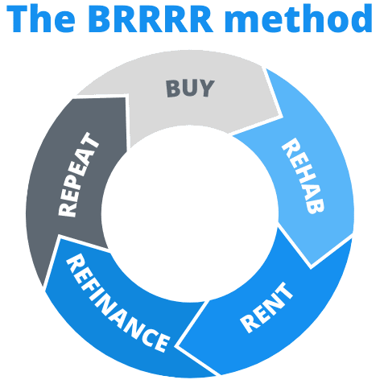

By basing the analytical framework on the BRRRR strategy, this project acknowledges the unique considerations and variables associated with this particular investment approach. It takes into account factors such as property acquisition costs, rehabilitation expenses, rental income potential, financing options, and refinancing opportunities. These elements are crucial in determining the feasibility and profitability of property investments within the BRRRR strategy.

## **Project Components**

The assessment of property investment feasibility involved several essential components to ensure a comprehensive analysis. These components encompassed the following key steps:

1. **Data Collection:** Property data was collected from publicly accessible property listing sites. This involved gathering relevant property information.

2. **Cost Definition:** Accurate and thorough cost estimation was a crucial aspect of the project. This involved identifying and defining all costs associated with the specific investment, ranging from initial purchase costs to loan expense and repair costs. 

3. **Calculations and Analysis:** Various calculations were performed to assess the potential performance of the property investment deal. These calculations included metrics such as return on investment (ROI), cash flow projections, net operating income (NOI), and cap rates. By utilizing these quantitative measures, the project aimed to provide a clear understanding of the financial viability and potential returns associated with the investment opportunity.

4. **Recommendation:** Based on the analysis conducted, a final recommendation was formulated regarding whether or not the property purchase should be pursued. This recommendation was backed by the findings and insights derived from the data analysis, cost assessment, and financial calculations. 

By defining these project components, a systematic and thorough assessment of property investment feasibility is ensured. The integration of data collection, cost analysis, quantitative calculations, and informed recommendations aimed to provide stakeholders with valuable insights to support the decision-making process.

## **Data Requirements and Limitations**

The assessment of property investment feasibility entails the collection and utilisation of diverse datasets, comprising of both publicly accessible information and input from the investor. While certain data can be obtained from public sources, it is essential to recognise that comprehensive and accurate analysis relies on the investor's domain knowledge and expertise. This analysis framework assumes that the user can provide the necessary data to ensure the accuracy and effectiveness of the assessment.

1. **Publicly Accessible Data:** Publicly accessible property listing sites provide a foundational dataset for the analysis. 

2. **Investor Input and Domain Knowledge:** The success of property investment hinges on the investor's domain knowledge and understanding of the variables pertaining to the investment. This framework assumes that the user possesses the requisite expertise to provide accurate data regarding costs and other property-specific factors. This input is crucial to ensure a comprehensive and reliable analysis.

It is important to acknowledge that the availability and accuracy of data may vary, posing potential limitations to the analysis. Some limitations to consider include:

1. **Data Availability:** Property specific details vary across listings and in some cases this could impact the completeness of the analysis.

2. **Data Reliability:** It is crucial to exercise diligence and verify the credibility of the data to minimize potential inaccuracies or biases in the analysis.

3. **Data Assumptions:** The requirement for cost estimations may also pose limitations. Certain cost variables like estimated repair costs and rehabilitation time relevant to the property will requiring the investor to make reasonable estimations. The accuracy of these assumptions will impact the assessment. 

Despite these limitations, the analysis framework assumes that the investor possesses the necessary expertise to navigate these challenges and provide the required data. By leveraging available data and incorporating investor input, the framework aims to provide valuable insights and support informed decision-making. 

## **Excel Table Design and Data Capture**

This section of the report provides an in-depth discussion of the design of the Excel table created for the property investment assessment. The focus is on outlining the different sections of data within the table, emphasizing the specific columns and the data captured in each section.

### **Property Information Collection**

Property information was collected from publicly accessible property listing websites such as property24.co.za. While the specific data available may vary across listings, there are several common data features typically found, including:

| Data Point | Description |
|---|---|
| Listing Number | Unique identifier
| Location | The geographic location of the property including suburb, city, municipality, and province. |
| Asking Price | The listed price of the property set by the seller. |
| Number of Bedrooms | The total number of bedrooms available in the property. |
| Number of Bathrooms | The total number of bathrooms available in the property. |
| Property Type | The specific classification of the property, e.g., house, apartment, or townhouse.|
| Total Square Meters (sqm) | The overall size of the property in square meters. |
| Property Taxes | Information on the applicable property taxes or levies associated with the property. |

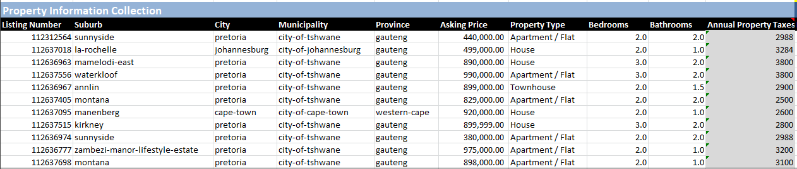

The data captured within this section is crucial for conducting a comparative analysis of the property. By assessing the property in relation to comparable listings, it becomes possible to evaluate whether the property is priced competitively and in suitable condition relative to other properties within the same location and market segment.

### **Purchase Information**

The Purchase Information section plays a vital role in the property investment analysis, as it involves capturing data specific to the investor's individual analysis. This section encompasses key variables that are essential for evaluating the feasibility and profitability of the investment. The data captured in this section includes:

| Data Point | Description |
| --- | --- |
| Purchase Price | The amount that the investor intends to pay for the property, representing the initial investment cost. |
| After Repair Value (ARV) | The estimated value of the property after necessary repairs and renovations have been completed. ARV is a critical factor for assessing potential appreciation and return on investment. |
| Estimated Rehab Cost | The projected cost of repairs and renovations necessary to bring the property up to its desired condition. This cost is particularly relevant for investors employing the BRRRR (Buy Rehab Rent Refinance Repeat) strategy. |
| Cash Purchase | Indicating whether the purchase will be financed or made entirely with cash. This distinction impacts calculations related to financing costs, interest rates, and overall investment profitability. |

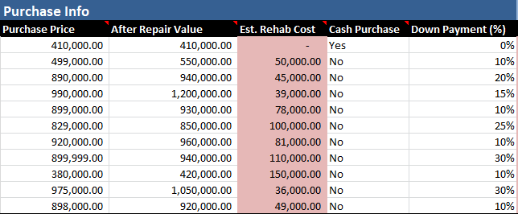

### **Acquisition Loan Information**

The Acquisition Loan Information section focuses on the loan utilized for the initial acquisition of the property. This section captures various data points that are crucial for evaluating the financial aspects associated with the acquisition loan. The data points include:

| Data Point | Description |
| --- | --- |
| Down Payment % | Percentage of the property cost to calculate cash amount.
| Down Payment Amount | If a loan is being used to purchase the property, the down payment is the cash amount contributed towards the purchase. It reduces the monthly debt repayment amounts and is typically a percentage of the purchase price. |
| Acq. Loan Interest Rate | The interest rate associated with the acquisition loan, representing the cost of borrowing funds for the property purchase. |
| Closing Cost | The expenses associated with the property transfer process, including fees, taxes, and legal costs. |
| Acq. Fees Charged | Fees associated with obtaining the acquisition loan are accounted for in this data point. |
| Acq. Loan Fees Structure | A binary column indicating whether the fees associated with the loan are included in the loan amount or paid out of pocket. |
| Acq. Loan Interest Only | A binary column indicating whether only the interest on the loan will be paid initially, without reducing the principal loan amount. |
| Acq. Loan Includes PMI | A binary column indicating whether private mortgage insurance (PMI) will be an added cost as part of the acquisition loan. |
| Acq. Loan Amortization (y) | The term length of the acquisition loan, expressed in years, which determines the duration for repaying the loan. |
| Time To Refinance (m) | The expected time until the initial loan will be refinanced. This data point helps plan for refinancing opportunities and potential changes in interest rates or loan terms. |
| Est. Rehab Time (m) | The anticipated time in months required for the rehabilitation of the property to be completed. This data point is valuable for project planning and estimating the duration of the renovation process. |

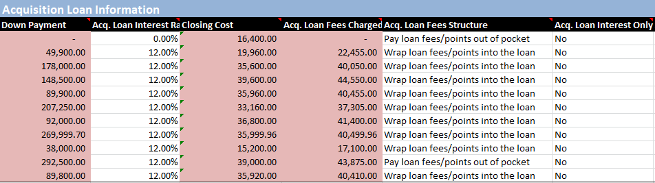

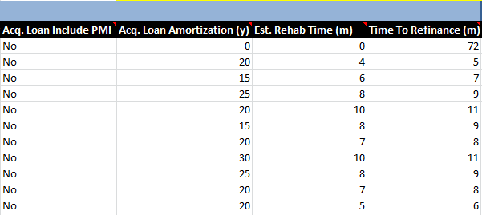

### **Refinance Loan Information**

In the BRRRR (Buy Rehab Rent Refinance Repeat) strategy, the acquisition loan and refinance loan are distinct stages of the investment process. The stages involved are as follows:

1. **Acquisition Loan:** The acquisition loan is the initial loan used to purchase the property, providing the necessary funds for acquiring the property in its current condition.
2. **Rehabilitation and Renovation:** After acquiring the property, the investor undertakes renovations and improvements to enhance its value. Funding for the rehabilitation may come from the investor's own funds or additional financing sources such as personal loans or home equity loans.
3. **Refinance Loan:** Once the property has been renovated and its value has increased, the investor pursues a refinance loan. This new loan is based on the improved value of the property and serves to pay off the original acquisition loan, potentially providing additional funds for future investments.

The following data points are relevant for the refinance loan section:

| Data Point | Description |
| --- | --- |
| Ref. Loan (%) of PV | This column simplifies the input for the loan amount as a percentage of the property's value. |
| Ref. Loan Amount | The total amount that will be loaned for the refinance. |
| Ref. Loan Interest Rate | The interest rate associated with the refinance loan. |
| Ref. Loan Fees Charged | Fees associated with obtaining the refinance loan. |
| Bundle Ref. Loan Fees | A binary column indicating whether the fees associated with the loan are included in the loan amount or paid out of pocket. |
| Ref. Loan Interest Only | Indicates whether the loan will have an interest-only payment option initially. |
| Ref. Loan Include PMI | Specifies whether private mortgage insurance (PMI) is included as part of the refinance loan. |
| Ref. Loan Amortisation (y) | The term length of the refinance loan, expressed in years. |

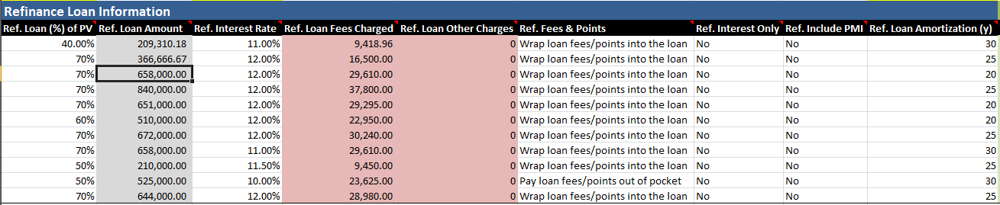

### **Expected Income**

The Expected Income section focuses on the anticipated income generated from the property investment. It includes the following data points:

| Data Point | Description |
| --- | --- |
| Total Gross Rent (m) | This column captures the total monthly gross rental income expected from the property. |
| Other Income | This data point accounts for any additional income sources related to the property investment that are not directly tied to rental income. It can include income from parking spaces, storage units, or other amenities associated with the property. |

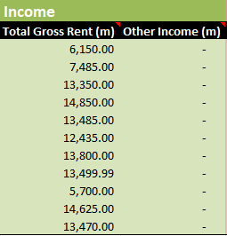

### **Fixed Landlord-Paid Expenses**

The Fixed Landlord-Paid Expenses section covers the recurring expenses that are the responsibility of the landlord. These expenses remain relatively constant over time and are essential for accurately assessing the financial aspects of the property investment. The following data points are included:

| Data Point | Description |
| --- | --- |
| Electricity (m) | This column captures the monthly cost of electricity paid by the landlord for the property. |
| Water & Sewerage (m) | The monthly expenses associated with water and sewerage services, which are borne by the landlord. |
| PMI (m) | Private Mortgage Insurance (PMI) refers to the monthly premium paid by the landlord if applicable. |
| Refuse (m) | The cost of refuse collection and disposal paid by the landlord on a monthly basis. |
| HOAs (m) | Homeowners Association (HOA) fees, if applicable, which are recurring monthly expenses incurred by the landlord. |
| Insurance (m) | The monthly cost of property insurance, including coverage for potential damages or liability. |
| Property Taxes (m) | This column captures the monthly property tax payments made by the landlord. |
| Other Expenses (m) | Any additional fixed expenses not covered by the previous categories. |
| Total Fixed Expenses (m) | The sum of all fixed expenses, representing the total monthly expenses incurred by the landlord. |

### **Variable Landlord-Paid Expenses**

The Variable Landlord-Paid Expenses section covers the expenses that can vary over time based on various factors. These expenses play a significant role in assessing the overall financial performance of the property investment. The following data points are included:

| Data Point | Description |
| --- | --- |
| Vacancy Cost (%) | This column represents the percentage of rental income reserved for covering potential vacancy periods when the property is unoccupied. |
| Vacancy Cost | Calculated actual amount allocated from the rental income to account for potential vacancies. |
| Repairs & Maintenance (%) | The percentage of rental income set aside for on-going repairs and maintenance of the property. |
| Repairs & Maintenance | Calculated actual amount of repairs and maintenance, based on the designated percentage of rental income. |
| Capital Expenditures (%) | The percentage of rental income allocated for major capital expenditures, such as replacing a roof or upgrading the property. |
| Capital Expenditures | Calculated actual amount of significant capital expenditures, calculated based on the designated percentage of rental income. |
| Management Fees (%) | The percentage of rental income paid to a property management company for their services, if applicable. |
| Management Fees | The calculated actual amount of money allocated from the rental income for property management services. |
| Total Variable Expenses (m) | The sum of all variable expenses, representing the total monthly expenses. |

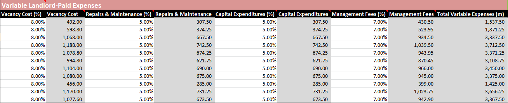

### **Future Assumptions**

The Future Assumptions section covers key assumptions made regarding future trends and growth in relation to the property investment. These assumptions play a vital role in projecting the long-term financial performance and potential returns of the investment. The following data points are included:

| Data Point | Description |
| --- | --- |
| Annual Income Growth (%) | This column represents the projected annual growth rate for the rental income generated by the property. |
| Annual PV Growth (%) | The projected annual growth rate for the property's market value or property value. |
| Annual Expense Growth (%) | The estimated annual growth rate for the property's operating expenses. |
| Sales Expenses (%) | This column represents the percentage of the property's selling price that will be allocated towards sales-related expenses, such as real estate agent commissions and closing costs, when the property is sold. |

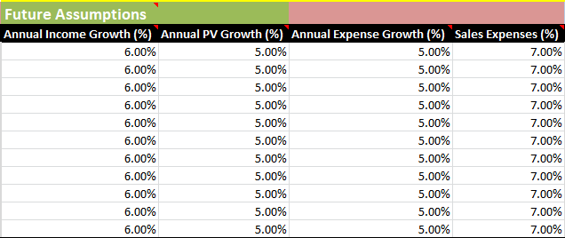

## **Variable Design Summary and Next Steps**

In this section, the data collection process which forms the foundation for assessing the feasibility of the property investment is outlined. The next crucial step is to design and calculate the necessary metrics that will enable an effective evaluation of the property's viability as an investment.

The primary objective of this study is to develop a robust framework that objectively determines whether a property qualifies as a feasible investment. The subsequent section will delve into the process employed to generate the essential features required for this assessment. Additionally, it will provide an overview of the metrics used to make the final determination regarding the investment's potential.

## **Feature Generation and Assessment Metrics**

This section deals with the process of generating the necessary features and metrics to assess the investment feasibility of the property. The careful design and calculation of these features can effectively evaluate key aspects of the deal such as potential returns, risks, and overall viability.

The feature generation process involves transforming the collected data into meaningful variables that provide insights into the investment's potential performance. These features serve as inputs for the assessment metrics, which are quantitative measures used to evaluate the property's financial viability.

### **Acquisition Period Metrics**

This section of the analysis focuses on calculated fields related to the acquisition of the property. These metrics are derived from the collected data and aim to provide insights into the financial aspects of the acquisition phase until the time of refinancing.

| Metric | Formula | Description | 
| --- | --- | ---| 
| Total Project Cost | =SUM([@[Purchase Price]],[@[Purchase Closing Cost]],[@[Est. Rehab Cost]]) | The total cost of the project, including the purchase price, closing costs, and estimated rehabilitation costs.|
| Acq. Loan Total | =IF([Cash Purchase]="Yes",0,IF([@[Acq. Loan Fees & Points]]="Wrap loan fees/points into the loan", SUM(([@[Purchase Price]]-[@[Down Payment]]),[@[Acq. Loan Fees Charged]],[@[Acq. Loan Other Charges]]),([@[Purchase Price]]-[@[Down Payment]]))) | The total acquisition loan amount, taking into account factors such as down payment, loan fees, and other charges.|
| Acq. Loan Total Fees | =[@[Acq. Loan Fees Charged]]+[@[Acq. Loan Other Charges]] | The total fees associated with the acquisition loan, including charges and points.|
| Acq. Monthly P&I | =IF([@[Total Acq. Loan]]=0,0,(ABS(PMT(([@[Acq. Loan Interest Rate]]/12),([@[Acq. Loan Amortization (y)]]*12),[@[Total Acq. Loan]])))) | The monthly principal and interest payment for the acquisition loan.|
| Cash Needed at Purchase | =IF([@[Cash Purchase]]="Yes",SUM([@[Purchase Price]],[@[Purchase Closing Cost]]),IF([@[Acq. Loan Fees & Points]]="Wrap loan fees/points into the loan",SUM([@[Down Payment]],[@[Purchase Closing Cost]],[@[Est. Rehab Cost]]),SUM([@[Down Payment]],[@[Purchase Closing Cost]],[@[Est. Rehab Cost]],[@[Acq. Loan Total Fees]]))) | The amount of cash required at the time of purchase, considering factors such as down payment, closing costs, and loan fees (if applicable).|

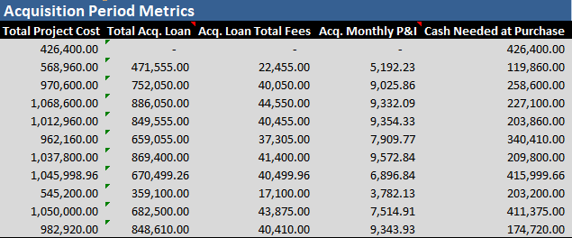

### **Rehabilitation Period Metrics**

The rehab metrics focus on the costs associated with holding the property during the initial rental period when no income is expected due to the property being uninhabited. These metrics provide insights into the financial implications of the rehab stage in the BRRRR strategy.

| Metric | Formula | Description |
| --- | --- | --- |
| Holding Costs | =(SUM([@[Acq. Monthly P&I]],[@[Total Fixed Expenses (m)]]))*[@[Est. Rehab Time (m)]] | The total holding costs during the estimated rehab time, including monthly principal and interest payment and fixed expenses multiplied by the rehab time. |
| Total Cash Outlay | =SUM([@[Cash Needed at Purchase]],[@[Holding Costs]]) | The total cash outlay required for the property, including the cash needed at purchase and the holding costs during the rehab period. |

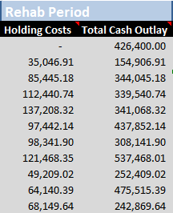

### **Initial Rental Period Metrics**

The initial rental period metrics focus on the financial aspects of the period from the completion of the rehab stage until the acquisition loan is refinanced. These metrics provide insights into the expected income and expenses during this period, as well as the financial performance of the property.

| Metric | Formula | Description |
| --- | --- | --- |
| Gross Income (m) | =[@[Total Gross Rent (m)]]+[@[Other Income (m)]] | The total annual gross income generated by the property, including the total gross rent and any other additional income sources. |
| Total Expenses (m) | =SUM([@[Acq. Monthly P&I]],[@[Total Fixed Expenses (m)]],[@[Total Variable Expenses (m)]]) | The total monthly expenses associated with the property, including both fixed and variable expenses. |
| Initial Cashflow (m) | =[@[Gross Income (m)]]-[@[Total Expenses (m)]] | The net cash flow generated by the property during the initial rental period. |
| Initial NOI | =([@[Gross Income (m)]]-([@[Total Expenses (m)]]-[@[Acq. Monthly P&I]]))*12 | The net operating income (NOI) of the property during the initial rental period, calculated by deducting the total expenses from the gross income. |
| Pro Forma Cap Rate | =([@[Initial NOI]]/([@[Purchase Price]]+[@[Purchase Closing Cost]]+[@[Est. Rehab Cost]]+[@[Holding Costs]])) | The capitalisation rate (Cap Rate) of the property, based on the initial NOI and the total project cost including the holding costs. |
| Purchase Cap Rate | =[@[Initial NOI]]/[@[Purchase Price]] | The capitalisation rate (Cap Rate) of the property at the time of purchase, based on the initial NOI and the purchase price. |
| Initial Cash on Cash ROI (y) | =([@[Initial Cashflow (m)]]/[@[Cash Needed at Purchase]])*12 | The annualised cash-on-cash return on investment (ROI) during the initial rental period, calculated by dividing the annual cash flow by the cash invested at purchase. |

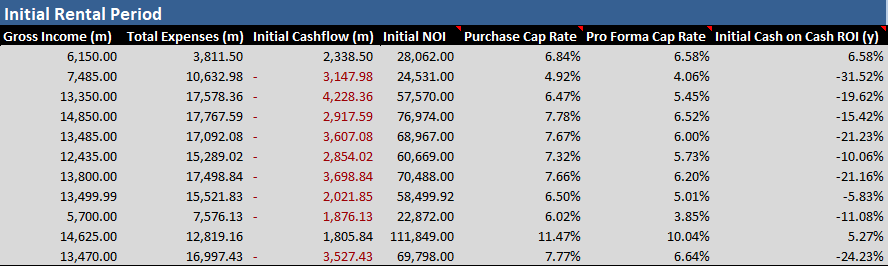

### **Refinanced Metrics**

The refinance metrics focus on the financial implications and benefits of refinancing the property after completing the initial rental period. Refinancing allows for a recalibration of the financing costs, potentially reducing the monthly principal and interest (P&I) expenses and increasing the monthly cash flow.

| Metric | Formula | Description |
| --- | --- | --- |
| Total Ref. Loan | =IF([@[Ref. Fees & Points]]="Wrap loan fees/points into the loan", SUM(([@[Ref. Loan Amount]],[@[Ref. Loan Fees Charged]],[@[Ref. Loan Other Charges]])),[@[Ref. Loan Amount]]) | The total amount of the refinance loan obtained after the property has been renovated and its value has increased. Formula accounts for whether or not the fees were wrapped in the loan or paid upfront |
| Ref. Loan Total Fees   | =[@[Ref. Loan Fees Charged]]+[@[Ref. Loan Other Charges]] | The total fees associated with obtaining the refinance loan, including charges and other costs. |
| Ref. Monthly P&I | =IF([@[Time To Refinance (m)]]=0,0,ABS(PMT(([@[Ref. Interest Rate]]/12),([@[Ref. Loan Amortization (y)]]*12),[@[Total Ref. Loan]]))) | The monthly principal and interest (P&I) payment for the refinance loan. Calculated using the PMT() function |
| Total Cash In Deal | =[@[Cash Needed at Purchase]]-(ABS([@[Initial Cashflow (m)]]*[@[Time To Refinance (m)]])) | The total net cash still locked up in the property, calculated as the cash needed at purchase minus the initial cash flow generated during the initial rental period. |

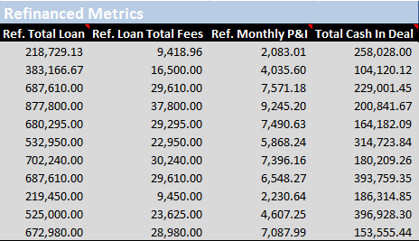

### **Refinanced Rental Metrics**

The refinanced rental period metrics provide an evaluation of the property's financial performance after undergoing loan refinancing. These recalculated values are essential for conducting the final assessment of the property's investment potential.

| Metric | Formula | Description |
| --- | --- | --- |
| Ref. Gross Income (m)  | =([@[Gross Income (m)]])*(1+[@[Annual Income Growth (%)]])^(1*(ROUND(([@[Time To Refinance (m)]]/12),0)-1)) | The total gross income generated by the property during the refinanced rental period. Accounts for expected annual increase in income |
| Ref. Total Expenses (m)  | =SUM([@[Ref. Monthly P&I]],([@[Total Fixed Expenses (m)]]+[@[Total Variable Expenses (m)]])*(1+[@[Annual Expense Growth (%)]])^(1*(ROUND(([@[Time To Refinance (m)]]/12),0)-1)))  | The total expenses incurred during the refinanced rental period, encompassing all relevant costs associated with property ownership. Accounts for the expected annual increase in expenses |
| Ref. Cashflow (m) | =[@[Ref. Gross Income (m)]]-[@[Ref. Total Expenses (m)]]  | The net cash flow generated by the property during the refinanced rental period, calculated as the difference between the gross income and total expenses. |
| Ref. NOI (y) | =([@[Ref. Gross Income (m)]]-([@[Ref. Total Expenses (m)]]))*12  | The net annual operating income of the property during the refinanced rental period, obtained by deducting operating expenses from the gross income. It represents the property's profitability before considering financing and taxes. |
| Cash on Cash ROI (y) | =[@[Ref. Cashflow (m)]]/[@[Total Cash In Deal]]*12 | The cash-on-cash return on investment expressed as a percentage per year at the time of refinancing. |

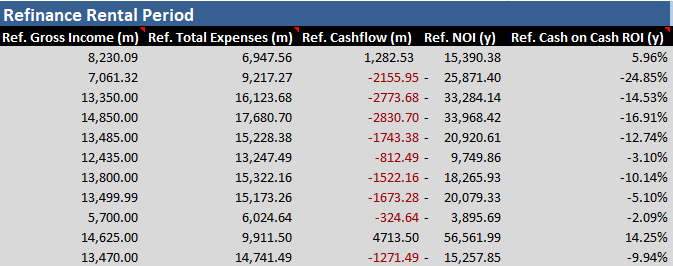

### **Financial Metrics**
In this section, the final metrics are calculated, which play a crucial role in assessing the viability of the property investment:

| Metric | Formula | Description |
| --- | --- | --- |
| 2% Rule | =[@[Gross Income (m)]]/([@[Purchase Price]]+ [@[Purchase Closing Cost]]+[@[Est. Rehab Cost]]) | Determines if the monthly rental income is at least 2% of the total acquisition cost. |
| Total Initial Equity | =IF([@[Cash Purchase]]="Yes",[@[After Repair Value]],[@[After Repair Value]]-[@[Purchase Price]]+[@[Down Payment]]) | The total initial equity in the property, calculated as the After Repair Value (ARV) minus the purchase price, adjusted for any cash down payment. If the property was purchased without an acquisition loan, the value is equal to the ARV.  | 
| Gross Rent Multiplier | =([@[Purchase Price]]+[@[Purchase Closing Cost]]+[@[Est. Rehab Cost]])/([@[Gross Income (m)]]*12) | Measures the relationship between the purchase price of the property and its gross rental income. It helps assess the investment's income potential. |
| Acq. Debt Coverage Ratio | =IF([@[Cash Purchase]]="Yes","No Acq. Loan",[@[Initial NOI]]/([@[Acq. Monthly P&I]]*12)) | Calculates the property's ability to generate sufficient income to cover the monthly mortgage payment and associated expenses during the acquisition period. Formula checks if an acquisition loan was utilised |
| Ref. Debt Coverage Ratio | =IF([@[Time To Refinance (m)]]=0,"No Ref. Loan",[@[Ref. NOI (y)]]/([@[Ref. Monthly P&I]]*12)) | Assesses the property's ability to generate sufficient income to cover the monthly mortgage payment and associated expenses after refinancing. Checks if refinance is planned |
| Deal Check | =IF(OR([@[Ref. Debt Coverage Ratio]]<1,[@[Acq. Debt Coverage Ratio]]<1,[@[Ref. Cashflow (m)]]<0,[@[Initial Cashflow (m)]]<0)=TRUE,"No Deal","Proceed") | The formula checks for certain conditions that may indicate a potential issue with the investment. If any of the following conditions are met: the Refinance Debt Coverage Ratio is less than 1, the Acquisition Debt Coverage Ratio is less than 1, the Refinance Cashflow is negative, or the Initial Cashflow is negative, the metric evaluates to "No Deal." This means that the investment does not meet the desired criteria. Conversely, if none of the specified conditions are met, the metric evaluates to "Proceed," indicating that the investment appears to be feasible. |

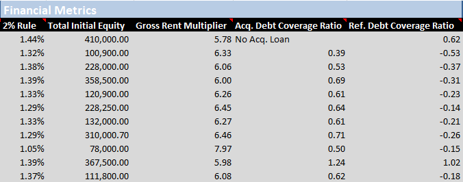

### **Deal Qualification**

The final step is to qualify the property as a deal worth pursuing. This assessment takes into account all available data, and the outcome of this section is a binary column indicating whether the deal should be pursued or not.

| Metric | Formula | Description |
| --- | --- | --- |
| Min. Desired Cashflow (m) | User input | A user-defined value representing the desired monthly cashflow amount from the property investment. It is the minimum amount of positive cashflow that the investor aims to achieve |
| Cashflow Score | =IF([@[Deal Check]]="Proceed",(SUM([@[Initial Cashflow (m)]],[@[Ref. Cashflow (m)]])/2)/[@[Min. desired cashflow (m)]],"-") | Assigns a numeric score calculated by dividing the sum of the Initial Cashflow and Refinance Cashflow by 2 and then dividing it by min. desired monthly cashflow. A higher score indicates stronger cashflow and potential profitability.  |
| Debt Coverage Score  | =IF([@[Deal Check]]="Proceed",(SUM([@[Acq. Debt Coverage Ratio]],[@[Ref. Debt Coverage Ratio]])),"-") | Calculates a numeric score based on the property's ability to generate sufficient income to cover mortgage payments and expenses. |
| Property Score | =IFERROR([@[Debt Coverage Score]]+[@[Cashflow Score]],"-") | Represents a numeric score derived from the sum of the debt coverage score and the cashflow score. It allows for a relative ranking of feasible investment properties, indicating which ones are more favourable for pursuit. The higher the property score, the more favourable the property is in terms of debt coverage and cashflow.
| Property Rank | =IFERROR(RANK.EQ([@[Property Score]],[Property Score]),"-") | Assigns a rank to the property based on its favourability compared to other analysed properties. The property rank indicates a relative position in terms of desirability or attractiveness for investment. |
| Offer To Purchase | User input | A column to keep track of whether or not an offer to purchase has been made on the respective property. |

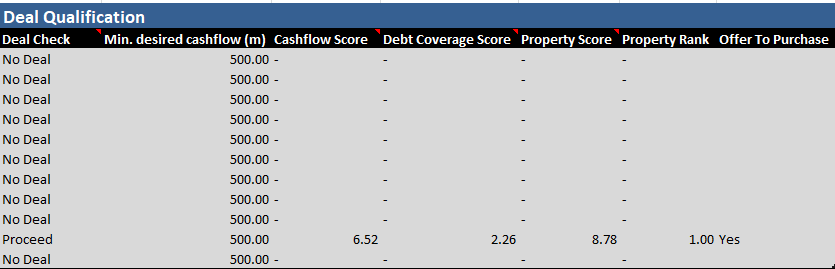